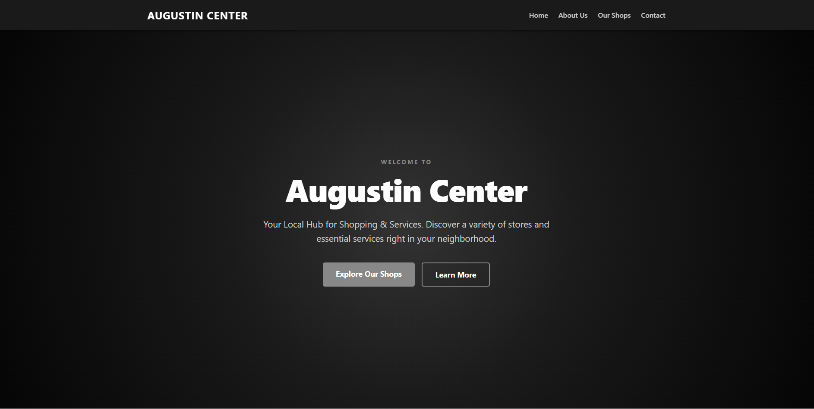
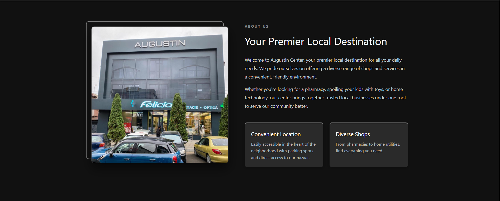
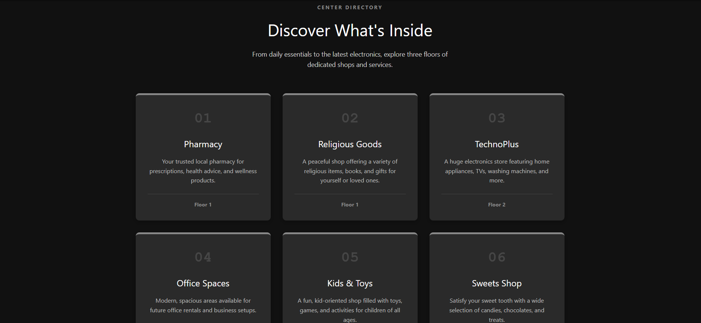
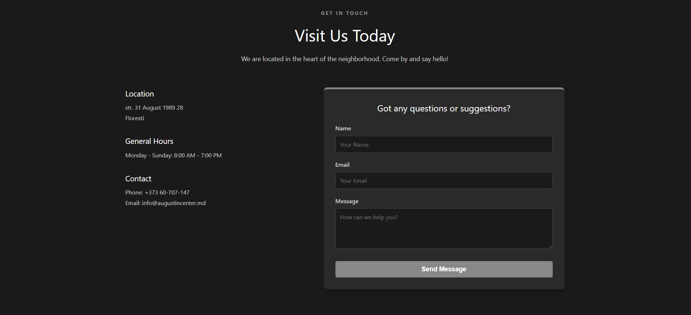

# Augustin Center - Local Trading Hub Landing Page

A modern, clean landing page for **Augustin Center**, a local trading hub offering a variety of shops and services across three floors.

## About the Project

Augustin Center is a premier local destination designed to bring trusted businesses together under one roof. The center provides a convenient and friendly environment for the community's daily needs, featuring everything from pharmacies to electronics.

### Shops & Services Featured
- **Floor 1:** Pharmacy & Religious Goods
- **Floor 2:** TechnPlus (Electronics) & Office Spaces
- **Floor -1:** Kids & Toys & Sweets Shop

## Live Demo

🔗 [View Live Demo](https://vasiok11.github.io/lab2-web/landing-page/)

## Screenshots

## Tech Stack
- HTML5
- Vanilla CSS
- No frameworks

## Features
- ✅ Responsive navigation with smooth scrolling
- ✅ Hero section with a dramatic radial gradient and dual call-to-actions
- ✅ About section featuring an offset image design
- ✅ Shop directory grid with hover effects and numbered cards
- ✅ Contact section with location details and a functional-looking form
- ✅ Multi-column footer with quick links and social media
- ✅ Clean, modern dark theme (grayscale and white)

---